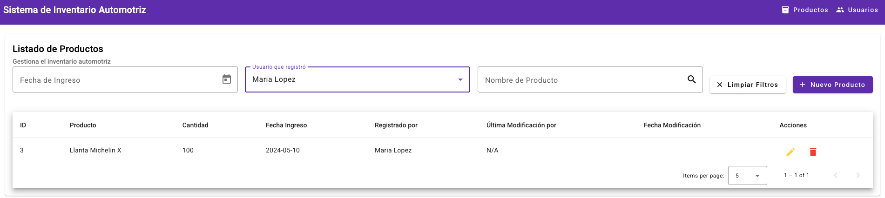

# Sistema de Gestión de Inventario Automotriz (Prueba Técnica)

Este proyecto es una prueba técnica que implementa un sistema para la gestión de productos y usuarios en un inventario automotriz. Fue desarrollado utilizando Angular.

## Características Principales

### Gestión de Productos

- Listado de productos.
- Creación de nuevos productos.
- Edición de productos existentes.
- Eliminación de productos (solo el usuario creador puede eliminar el producto).
- Filtrado de productos por nombre.
- Filtrado de productos por usuario asignado.
- Filtrado multiparámetro para productos.
- Validaciones y manejo de errores específicos (ej. producto con nombre duplicado, fecha futura no permitida).

### Gestión de Usuarios

- Listado de usuarios.
- Creación de nuevos usuarios.
- Edición de usuarios existentes.
- Filtrado de usuarios.

## Instalación y Ejecución

### Prerrequisitos

- Node.js
- Angular CLI (versión 16.2.16 o compatible)

Este proyecto fue generado con [Angular CLI](https://github.com/angular/angular-cli) version 16.2.16.

Para levantar el servidor de desarrollo, ejecuta `ng serve`. Navega a `http://localhost:4200/`. La aplicación se recargará automáticamente si cambias algún archivo fuente.

Para compilar el proyecto para producción, ejecuta `ng build`. Los artefactos de la compilación se almacenarán en el directorio `dist/`.

## Guía de Uso

A continuación, se muestra cómo utilizar las principales funcionalidades del sistema.

### Gestión de Productos

**Listado de Productos**
Visualiza todos los productos existentes en el inventario.

**Creación de Producto**
Permite agregar un nuevo producto al inventario mediante un formulario.

**Edición de Producto**
Permite modificar la información de un producto existente.

**Validaciones de Producto**
El sistema incluye validaciones para asegurar la integridad de los datos:

- Error al intentar crear un producto con un nombre que ya existe:
  
- Error al ingresar una fecha de registro futura:
  

**Eliminación de Producto**
Permite eliminar productos, con la restricción de que solo el usuario que creó el producto puede eliminarlo.

**Filtros de Producto**
Se pueden aplicar diversos filtros para facilitar la búsqueda de productos:

- Filtro por nombre de producto:
  
- Filtro por persona (usuario asignado):
  
- Filtro multiparámetro:
  

### Gestión de Usuarios

**Listado de Usuarios**
Muestra todos los usuarios registrados en el sistema.

**Creación de Usuario**
Permite registrar un nuevo usuario en el sistema.

**Edición de Usuario**
Permite modificar la información de un usuario existente.

**Filtro de Usuarios**
Permite filtrar usuarios según diferentes criterios.

